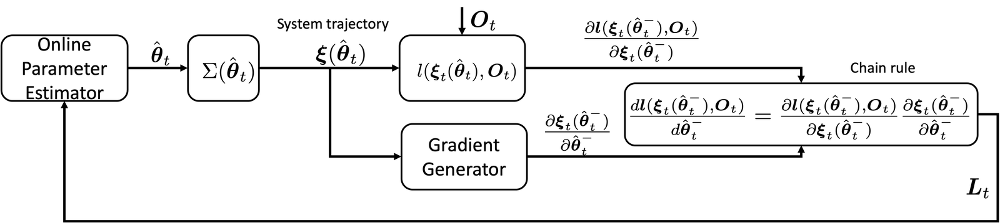
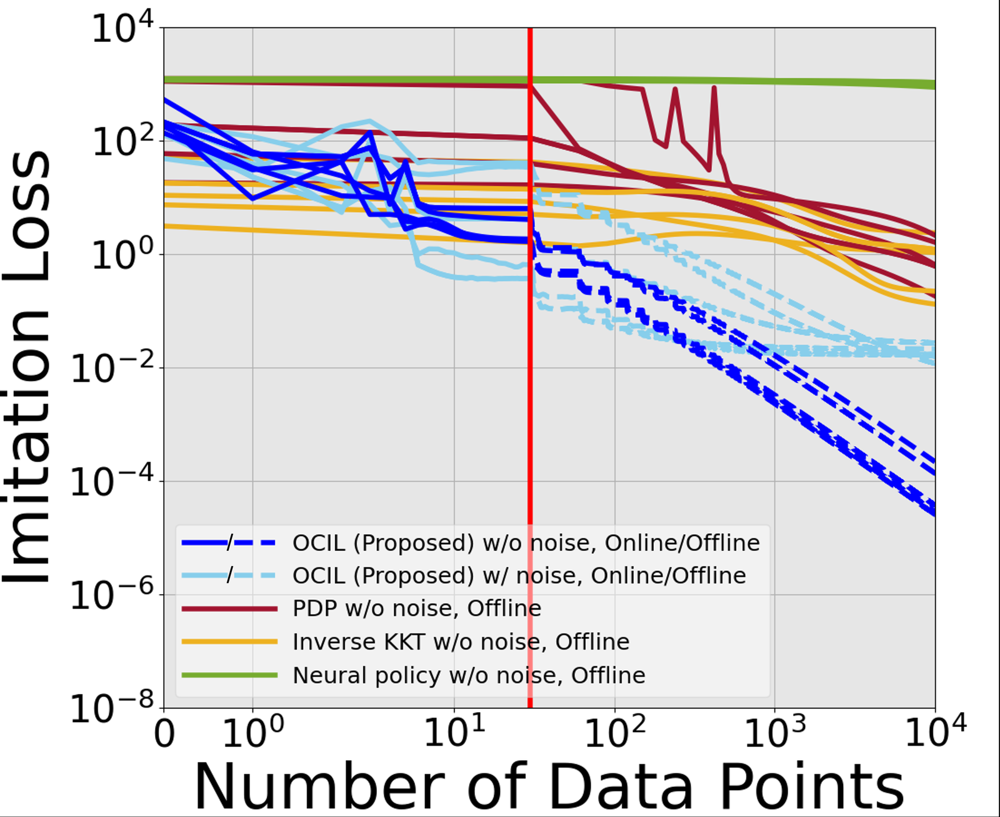
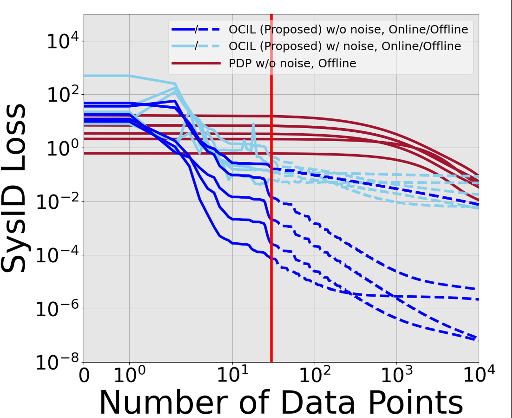
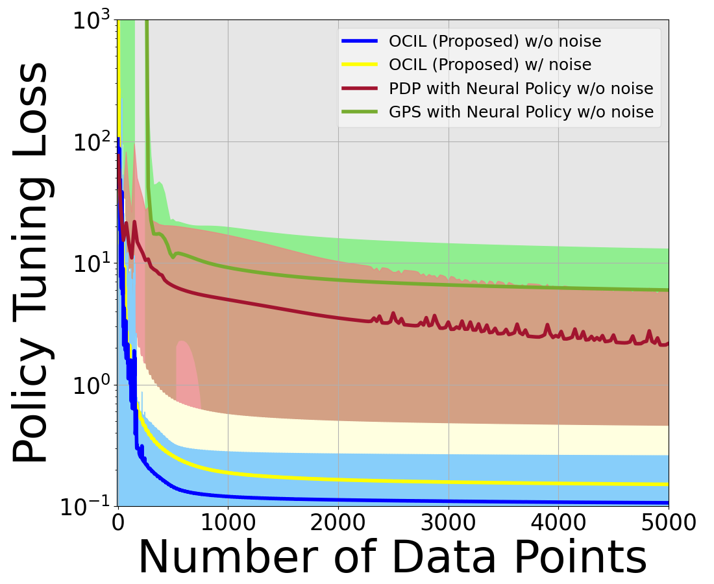

# OCIL — Online Control-Informed Learning

[](https://arxiv.org/abs/2410.03924)
[](LICENSE)

Reference implementation of **Online Control-Informed Learning**, by Zihao Liang,
Tianyu Zhou, Zehui Lu and Shaoshuai Mou.

OCIL treats a robot as a tunable optimal control system and learns its unknown
parameters from a stream of data, one measurement at a time. Two well-understood
pieces of control theory do the work. Pontryagin Differentiable Programming gives
the exact gradient of the trajectory with respect to the parameters, by
differentiating the optimality conditions into a second, linear control problem.
An extended Kalman filter then treats those parameters as a hidden state and
corrects them with each new observation.

There are no epochs, no replay buffer and no batch to wait for. Because the
filter carries an estimate of its own uncertainty, it also tolerates noisy
measurements rather than fitting them.

<p align="center">
  
</p>

<p align="center">
  <em>One update. The current estimate θ̂ produces a system trajectory ξ(θ̂). The
  gradient generator differentiates that trajectory with respect to θ̂, the loss
  is measured against the incoming observation O, and the chain rule turns the
  two into the correction L that the estimator applies.</em>
</p>

The same update rule covers three tasks, depending on which part of the control
problem is unknown.

| Learning mode | What is unknown | What it learns from |
|---|---|---|
| **Online imitation learning** | the cost weights, the dynamics, or both | one demonstrated trajectory |
| **Online system identification** | the dynamics, either as physical parameters or as a neural network | recorded inputs and states |
| **Policy tuning on the fly** | the weights of a neural feedback policy | the control objective itself |

<p align="center">
  
  
  
</p>

<p align="center">
  <em>Loss against the number of data points consumed, over five trials, one
  panel per learning mode. The red line in the first two marks one pass over the
  data: to the left of it every point has been seen exactly once, and the dashed
  continuation to the right reuses the same data offline. Each panel also plots
  OCIL on noisy measurements — the paler series — which ends above the clean run
  but still below every baseline.</em>
</p>

## Installation

The submodule carries the optimal control and gradient machinery, so clone
recursively:

```bash
git clone --recursive https://github.com/ZihaoLiang/OCIL-Online-Control-Informed-Learning.git
cd OCIL-Online-Control-Informed-Learning
```

If you already cloned without `--recursive`:

```bash
git submodule update --init --recursive
```

Then install the dependencies. Tested on Python 3.10 with NumPy 1.26, SciPy 1.15,
Matplotlib 3.10 and CasADi 3.7:

```bash
conda create -n ocil python=3.10
conda activate ocil
pip install numpy scipy matplotlib casadi
```

Those four packages are all the examples below need. Some scripts inside the
Pontryagin Differentiable Programming submodule additionally import PyTorch, but
nothing in `examples/` does.

## Quick start

**Run every script from the repository root.** Each one builds its import paths
and its data paths from the working directory, so launching from inside an
example folder will not find `src/`.

```bash
python examples/ImitationLearning/pendulum/pendulum_OCIL.py
```

This recovers two cost weights from a single 20-step demonstration. The loss
falls by roughly three orders of magnitude within one pass over the demo. A
window with the loss curve and the learned trajectory opens when it finishes.

## Examples

Each script sets up a system, picks a learning mode, initialises the filter and
calls `solve()`. Change the covariances `P`, `Q` and `R` at the top of a script
to change how aggressively the estimate moves.

### Online imitation learning

Recover what the demonstrator was optimising, and the physics it was operating
under, from one trajectory.

| System | Script | Learns |
|---|---|---|
| Pendulum | `examples/ImitationLearning/pendulum/pendulum_OCIL.py` | 2 cost weights |
| Cart-pole | `examples/ImitationLearning/cartpole/cartpole_OCIL.py` | 3 dynamics + 4 cost |
| Quadrotor | `examples/ImitationLearning/uav/uav_OCIL.py` | 5 dynamics + 4 cost |
| Rocket | `examples/ImitationLearning/rocket/rocket_OCIL.py` | 5 dynamics + 5 cost |

### Online system identification

Recover the dynamics from recorded inputs and states. The `nn_` scripts replace
the physical model with a neural network written as a CasADi expression, and the
`_PDP` scripts run Pontryagin Differentiable Programming on the same problem for
comparison.

| System | Physical parameters | Neural dynamics |
|---|---|---|
| Pendulum | `examples/SysID/pendulum/pendulum_OCIL.py` | — |
| Cart-pole | `examples/SysID/cartpole/cartpole_OCIL.py` | `examples/SysID/cartpole/nn_cartpole.py` |
| Quadrotor | `examples/SysID/uav/uav_OCIL.py` | `examples/SysID/uav/nn_uav.py` |
| Rocket | `examples/SysID/rocket/rocket_OCIL.py` | `examples/SysID/rocket/nn_rocket.py` |

### Policy tuning on the fly

Tune the weights of a neural feedback policy online. The `_traj` scripts match both
states and controls against a reference, `_state` matches states only, and the
`_obj` scripts minimise the control cost directly.

| System | Track a trajectory | Minimise the objective |
|---|---|---|
| Pendulum | `examples/PolicyTuning/pendulum/pendulum_OCIL_traj.py`<br>`examples/PolicyTuning/pendulum/pendulum_OCIL_state.py` | — |
| Cart-pole | `examples/PolicyTuning/cartpole/cartpole_OCIL_traj.py` | `examples/PolicyTuning/cartpole/cartpole_OCIL_obj.py` |
| Quadrotor | `examples/PolicyTuning/uav/uav_OCIL_traj.py` | `examples/PolicyTuning/uav/uav_OCIL_obj.py` |
| Rocket | `examples/PolicyTuning/rocket/rocket_OCIL_traj.py` | `examples/PolicyTuning/rocket/rocket_OCIL_obj.py` |

## How the code is organised

```
src/
  OCIL.py           the three learning modes: ImitationLearning, SysID, PolicyTuning
  EKF.py            the extended Kalman filter predict and update steps
  JinEnv_NN.py      pendulum, cart-pole, quadrotor and rocket, with neural
                    dynamics and neural cost variants
externals/
  Pontryagin-Differentiable-Programming/
                    the optimal control solver, the auxiliary control system
                    that produces the gradient, and the original environments
examples/           one folder per learning mode, per system, with the
                    demonstration data and saved baseline results
test/               standalone iterative LQR scripts
images/             the figures above
```

Every mode runs the same five steps for each incoming data point. Solve the
optimal control problem with the current parameters. Build the auxiliary control
system and solve it for the derivative of the trajectory with respect to those
parameters. Take the residual between the prediction and the observation at one
time step. Chain the two together into the filter's measurement matrix. Correct
the parameters.

## Notes

- **The plots block.** Each `solve()` ends with a blocking Matplotlib window. For
  unattended runs set a non-interactive backend: `MPLBACKEND=Agg python ...`

- **Cost weights are identifiable only up to scale.** Multiplying every weight in
  the objective by the same constant leaves the optimal trajectory unchanged, so
  the parameter error can look large while the trajectory matches the
  demonstration exactly. Judge imitation results by the trajectory loss, and
  compare cost weights by their ratios.

- **Learning dynamics and cost together is sensitive to the starting guess.**
  Mode `"All"` converges from most random initialisations but not all. If a run
  flattens out at a high loss, re-run it, or set the spread of the initial guess
  with `set_sigma()`.

- **Cost per data point is high.** Every update re-solves the full optimal control
  problem and the full auxiliary system, then uses one time index of the result.
  This is what buys an exact gradient rather than an approximate one, but it means
  the cost of a pass grows with the square of the horizon.

## Reproducing the figures

Each example folder carries the saved loss traces for OCIL and for the baselines
it is compared against, along with the script that draws the figure:

```bash
cd examples/ImitationLearning/cartpole/data
python plot.py
```

Baselines included in the saved results are Pontryagin Differentiable
Programming, inverse KKT, dynamic mode decomposition with control, guided policy
search, iterative LQR, and neural networks trained with Adam.

## Citation

```bibtex
@article{liang2024online,
  title   = {Online Control-Informed Learning},
  author  = {Liang, Zihao and Zhou, Tianyu and Lu, Zehui and Mou, Shaoshuai},
  journal = {arXiv preprint arXiv:2410.03924},
  year    = {2024}
}
```

## Acknowledgements

The optimal control solver, the auxiliary control system used to generate
gradients, and the simulated environments come from
[Pontryagin Differentiable Programming](https://github.com/wanxinjin/Pontryagin-Differentiable-Programming)
by Wanxin Jin and colleagues.

## License

MIT. See [LICENSE](LICENSE).
